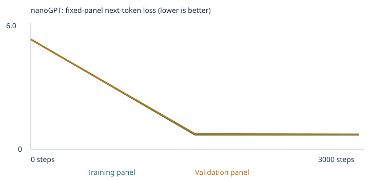
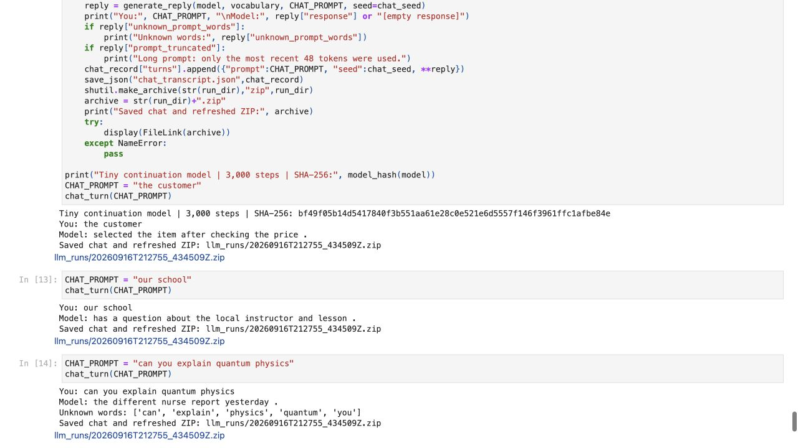
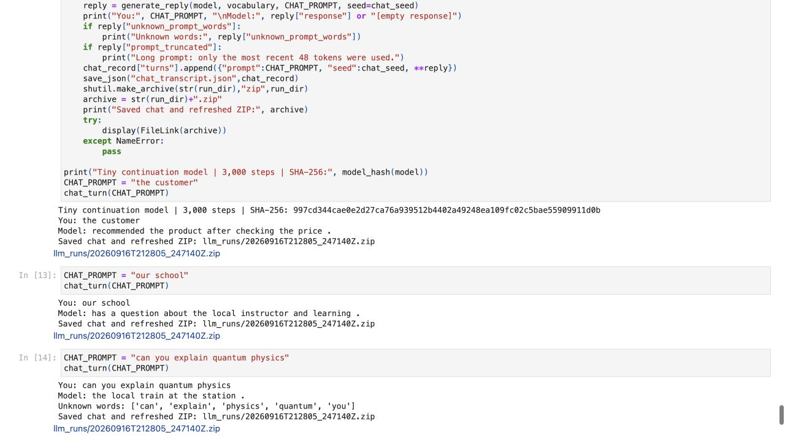

# Assignment 3: Building a Custom LLM

## Overview and grading entry point

Two fresh nanoGPT experiments implement the updated Assignment 3 requirements:
the supplied classroom corpus and the same corpus expanded with **grammar and
opposites/contextual contrasts**. Each completes 3,000 optimizer steps and runs
all 48 unchanged course evals before and after training (192 case records total).
Both were executed top-to-bottom on **local macOS ARM64 CPU**, not Colab.
No pretrained weights, model APIs, or external language model responses are used
by the training, evaluation, or chat interface.

The result is a tiny word-level continuation model, not a general-purpose chatbot.
All-case success is 20/48 for the trained starter and 27/48 for the trained expansion;
many extension tests remain unknown-word failures. These scores are measurements,
not assignment grades. The course grades deliverable quality 4 + evaluation 3 +
working result 3; it requires valid experiments and interpretation, not a minimum
score. The submission portal has **not** been submitted automatically.

Sources: [updated assignment](https://docs.google.com/document/d/1MQ3YQl2ywWZF7W5_l_91FiIp7pTYPO_3viI2JVapRcc/edit),
[course starter revision](https://github.com/pepealonso95/custom-llm/tree/9e04ddb6aacb8efcb790e70c62550ca55e0f2a75),
and [Karpathy's nanoGPT model](https://github.com/karpathy/nanoGPT/blob/3adf61e154c3fe3fca428ad6bc3818b27a3b8291/model.py).
The original nanoGPT source and [MIT license](NANOGPT_LICENSE) are retained.

- [Executed starter notebook](custom_llm.ipynb) · [starter results ZIP](results/starter-results.zip)
- [Executed expanded notebook](custom_llm_expanded.ipynb) · [expanded results ZIP](results/expanded-results.zip)
- [Unchanged 48-case suite](evals/language_evals.json) · [official inference/scoring runner](run_evals.py)
- [Real model chat code](chat.py) · [starter chat screenshot](evidence/starter-chat.jpg) · [expanded chat screenshot](evidence/expanded-chat.jpg)

The previous-version experiment is preserved separately in [historical/](historical/README.md).
Its corpus contained prefixes now reserved for evaluation, so it is excluded from
the updated comparison. New benchmark scores are not attached to its old weights.

## Three choices and reasons

1. **Corpus:** `CORPUS = "classroom"` in both experiments. The starter uses the
   empty teaching folder `corpus/starter`; the expansion uses `corpus/extension`.
   Classroom templates give a controlled baseline. The expansion addresses two
   missing language skills with permitted synthetic material, not private files.
2. **Training steps:** `TRAINING_STEPS = 3000` for each fresh model. This is the
   baseline budget and keeps the training comparison comparable. Each step samples
   32 training passages; a step is not one full pass through the corpus.
3. **Learning rate:** `LEARNING_RATE = 0.001`. The starter's 100-step warmup and
   cosine decay are retained. The actual first step uses 0.00001 and the schedule
   approaches 0.0001 near the end; 0.001 is the peak setting, not a constant rate.
   I retained the recommended 0.001 baseline in both experiments to keep optimizer
   settings comparable while changing the teaching corpus. Excessively large
   updates can overshoot useful parameter values and cause oscillating or nonfinite
   loss. Excessively small updates can make learning too slow to improve sufficiently
   within the 3,000-step budget. This is a baseline choice, not a claim that 0.001
   is optimal.

### Pre-training predictions

These predictions are recorded before the training cells in the executed notebooks.

**Starter:** untrained text should be incoherent; both panel losses should decline;
trained samples should resemble classroom templates. Customer's neighbors may
shift toward shopping words. Familiar patterns should be easier than new wording;
most extension skills should lack vocabulary. Neighbor similarity is not guaranteed
to match human judgments.

**Expansion:** extra grammar and contrasts should expand coverage and teach agreement,
tense, and contrasting descriptions. Loss should fall from its own untrained baseline,
although new templates may make the task harder. Grammar/opposite scores might
improve, but contrast sentences may not transfer to an unfamiliar question form.
Corpus balance may shift customer neighbors. General question answering and
untaught skills should remain unreliable.

## Corpus, vocabulary, split, and unknown tokens

The original generator makes 6,360 passages. In **each experiment**, the unchanged
reservation function excludes 160 generated passages containing fixed eval prefixes
**before** deduplication, splitting, and vocabulary fitting. The retained classroom
base has 6,200 passages and 4,592 unique passages.

| Experiment | Raw retained passages | Unique passages | Train | Validation | Vocabulary incl. 3 special tokens | Train UNK | Validation UNK | Parameters | Training time |
| --- | --- | --- | --- | --- | --- | --- | --- | --- | --- |
| starter | 6200 | 4592 | 4132 | 460 | 136 | 0.00% | 0.00% | 111872 | 6.755 s |
| expanded | 7104 | 5496 | 4946 | 550 | 232 | 0.00% | 0.00% | 118016 | 7.057 s |


Both use seed 42, 64-dimensional embeddings, 2 transformer blocks, 4 attention heads,
48-token context, batch size 32, and PyTorch 2.11.0 / Python 3.12.14. Training times
measure the optimizer loop including milestone recording, not setup/evaluation/export.
The vocabulary contains at most 509 training word/punctuation types plus `<UNK>`,
`<BOS>`, and `<EOS>`; no types were omitted in these runs. Lowercasing is deliberate.
See [starter config](results/starter/config.json), [expanded config](results/expanded/config.json),
the [starter vocabulary report](results/starter/vocabulary_report.json), and
[expanded vocabulary report](results/expanded/vocabulary_report.json).

Unique normalized passages are shuffled and split 90%/10% (rounded at the cut).
No passage overlaps train and validation within either run. This is a **passage
split**, not a source/template split: both sides share sentence structures, and
extension passages from the same file occur in both. Loss evaluates a fixed panel
of 20 training and 20 validation passages, with mean cross-entropy over non-padding
next-token targets. These small panels are not full-corpus loss or a generalization
test on new domains. Added data changes the split and panels; cross-run loss is
not an isolated causal comparison. Vocabulary size also changes parameter count
and random initialization, despite the same architecture and seed.

Zero train/validation UNK does **not** mean zero benchmark UNK: the held-out public
suite deliberately includes words and skills absent from these corpora.

### Extension categories and teaching sources

The [teaching TXT](corpus/extension/grammar_and_contrasts.txt) adds **904 unique
passages**: 424 grammar sentences and 480 contextual contrasts. It is generated
deterministically by [build_extension.py](build_extension.py), which does not read
evals, answer keys, saved outputs, or chat logs. There were no PDF extraction warnings:
this experiment uses one UTF-8 TXT file. Its exact checksum and passage count are in
[expanded corpus manifest](results/expanded/corpus_manifest.json); the starter imports
zero files ([manifest](results/starter/corpus_manifest.json)).

- **Grammar:** singular/plural animals and varied states; `is/are/was/were/am`;
  pronouns, destinations, and `walk/walks/walked/walking` with time cues.
  Examples: “A bird is awake this morning.”, “Several rabbits were quiet last
  evening.”, “She walked to the library last week.” These differ from the exam prefixes.
- **Opposites:** contrasts such as hot/cold drinks, empty/full baskets, and noisy/quiet
  streets, plus other descriptive contrasts, varied objects/places, comparisons,
  and transitions in both directions. Example: “At the garden, one drink is hot
  while another is cold.” Not every descriptive pair is a strict lexical antonym.
  This teaches contextual contrast, not a copied exam question/answer pair.

These categories were chosen because grammar exposes agreement/tense, while
contrasts probe whether related vocabulary alone supports a new language task.
Other extension categories are not deliberately taught in this required second run.

### Separation: the exam stays outside the textbook

Only `corpus/starter/` or `corpus/extension/` is imported. The fixed suite and answer
keys in `evals/`, the scoring code, `results/`, `historical/`, and chat logs are outside
those folders. They never supply training examples, target tokens, or vocabulary.
The loader rejects the repository root or an eval-containing directory as a corpus.
Imported text is checked before chunking; final passages are checked again.

Both [starter separation](results/starter/eval_separation.json) and
[expanded separation](results/expanded/eval_separation.json) record 160 reserved
passages and the same suite identity. Independent verification found **zero exact
normalized eval-prefix matches in either training or validation split**. Source
inspection also confirms varied teaching templates, no pasted answer lists/test
stories, and no outputs used for training. Exact-match checks cannot prove absence
of all semantic paraphrases or answer leakage; they are a safeguard, not a guarantee.
Underlying language facts can overlap the public benchmark without copying its items.

The suite file is byte-for-byte unchanged from the course revision; file SHA-256:
`e8affcd72841e3ed7da5c0b6b116327fe9f69c9abd66a1180d1d88ceaa3e17f7`.
The summaries hash canonical suite JSON as
`1d7c503f34d88260d0ac897bc36b8ba621cccc1950aef47e7121e69b2c1c9e1d`.
The two hashes represent different serializations of the same suite.
Because the tests are public and guide category selection, this is a **fixed
development benchmark**, not an untouched final test of unseen language ability.

## Training results: all measured losses

| Experiment | Completed step | Training panel loss | Validation panel loss |
| --- | --- | --- | --- |
| starter | 0 | 4.926252 | 4.927548 |
| starter | 1500 | 0.682138 | 0.718243 |
| starter | 3000 | 0.678312 | 0.706136 |
| expanded | 0 | 5.470248 | 5.462897 |
| expanded | 1500 | 0.717014 | 0.761651 |
| expanded | 3000 | 0.716538 | 0.740499 |




The plots connect **only three measured checkpoints**, not a loss recorded every
step. Each plot uses its own labeled y-scale; use the table for exact cross-run
values. Both losses decline sharply and remain close within each run. This supports
learning the narrow corpus patterns and the pre-training prediction. It does not
rule out template dependence or establish broad understanding. The expanded final
validation loss is higher on its different panel, despite its better public eval score.
See [starter history](results/starter/history.json), [expanded history](results/expanded/history.json),
[starter summary](results/starter/training_summary.json), and
[expanded summary](results/expanded/training_summary.json). Neither run was interrupted.

## Untrained, halfway, and final samples

The first actual sample at each checkpoint appears below. All four samples per
checkpoint—including garbled text and special tokens—are preserved in the links.
Sampling starts from BOS at temperature 0.8 with seed 2026 and a 32-token limit.

### Starter


**Step 0:** `pear professor bond doctor course harvest team physician journey checking buyer delivery traffic report the lecturer item offering and system <UNK> taste recommended mentioned bus question customer at mortgage nurse in instructor`

[All four samples](results/starter/samples/step_0000.txt)


**Step 1500:** `our school has a question about the new educator and lesson .`

[All four samples](results/starter/samples/step_1500.txt)


**Step 3000:** `our school has a question about the new educator and lesson .`

[All four samples](results/starter/samples/step_3000.txt)


### Expanded


**Step 0:** `hard discussed last bridge learned walking on walking reviewed reviewed one arrival street evening cat to code every horses <BOS> train loud mentioned fast train travel detail bridge village bridge report bicycle`

[All four samples](results/expanded/samples/step_0000.txt)


**Step 1500:** `our office has a question about the new website and update .`

[All four samples](results/expanded/samples/step_1500.txt)


**Step 3000:** `our school has a question about the new lecturer and lesson .`

[All four samples](results/expanded/samples/step_3000.txt)


Untrained outputs lack coherent sentence structure. Halfway/final samples recover
templates and domain vocabulary; apparent fluency is narrow and repetitive. The
small fixed sample is illustrative, not a claim that every continuation is good.

## The 48 fixed language evals: four complete result sets

For each case, only its prefix enters the network. The unchanged runner reads the
next-token distribution, ranks the four single-word choices afterward, and compares
the selection to the key. Ties score zero. A prompt or **any choice** outside the
training vocabulary makes the case out-of-vocabulary; unknown/overlong cases get
zero in all-case success, not accidental UNK credit. Scorable accuracy excludes
those unavailable cases. Coverage is scorable cases / 48. No cases are dropped.
Free text is generated separately (temperature 0.8, per-case seeds 2026+i, 24-token
limit); it is **not** what the multiple-choice score grades. Inference never updates weights.

| Experiment | Stage | Correct / 48 | All-case success | Scorable / coverage | Scorable accuracy | Complete results |
| --- | --- | --- | --- | --- | --- | --- |
| starter | untrained | 9/48 | 18.75% | 24/48 (50.00%) | 37.50% | [CSV](results/starter/language_evals/untrained/eval_results.csv) · [JSON](results/starter/language_evals/untrained/eval_results.json) · [summary](results/starter/language_evals/untrained/eval_summary.json) |
| starter | final | 20/48 | 41.67% | 24/48 (50.00%) | 83.33% | [CSV](results/starter/language_evals/final/eval_results.csv) · [JSON](results/starter/language_evals/final/eval_results.json) · [summary](results/starter/language_evals/final/eval_summary.json) |
| expanded | untrained | 6/48 | 12.50% | 27/48 (56.25%) | 22.22% | [CSV](results/expanded/language_evals/untrained/eval_results.csv) · [JSON](results/expanded/language_evals/untrained/eval_results.json) · [summary](results/expanded/language_evals/untrained/eval_summary.json) |
| expanded | final | 27/48 | 56.25% | 27/48 (56.25%) | 100.00% | [CSV](results/expanded/language_evals/final/eval_results.csv) · [JSON](results/expanded/language_evals/final/eval_results.json) · [summary](results/expanded/language_evals/final/eval_summary.json) |


### Group and category results

Each cell is **correct / total; scorable / total**. A zero with no scorable cases
is missing coverage, not measured incorrect reasoning on known words. Every group
and category, including failures, is retained in each linked summary above.

| Group or category | starter untrained | starter final | expanded untrained | expanded final |
| --- | --- | --- | --- | --- |
| extend_corpus | 0/24; 0/24 | 0/24; 0/24 | 1/24; 3/24 | 3/24; 3/24 |
| starter_patterns | 6/16; 16/16 | 16/16; 16/16 | 4/16; 16/16 | 16/16; 16/16 |
| starter_transfer | 3/8; 8/8 | 4/8; 8/8 | 1/8; 8/8 | 8/8; 8/8 |


| Group or category | starter untrained | starter final | expanded untrained | expanded final |
| --- | --- | --- | --- | --- |
| categories_and_analogies | 0/3; 0/3 | 0/3; 0/3 | 0/3; 0/3 | 0/3; 0/3 |
| domain_context | 3/8; 8/8 | 8/8; 8/8 | 1/8; 8/8 | 8/8; 8/8 |
| domain_place | 3/8; 8/8 | 8/8; 8/8 | 3/8; 8/8 | 8/8; 8/8 |
| everyday_knowledge | 0/3; 0/3 | 0/3; 0/3 | 0/3; 0/3 | 0/3; 0/3 |
| grammar | 0/3; 0/3 | 0/3; 0/3 | 1/3; 3/3 | 3/3; 3/3 |
| negation | 0/3; 0/3 | 0/3; 0/3 | 0/3; 0/3 | 0/3; 0/3 |
| new_wording | 3/8; 8/8 | 4/8; 8/8 | 1/8; 8/8 | 8/8; 8/8 |
| opposites | 0/3; 0/3 | 0/3; 0/3 | 0/3; 0/3 | 0/3; 0/3 |
| reference | 0/3; 0/3 | 0/3; 0/3 | 0/3; 0/3 | 0/3; 0/3 |
| sequence | 0/3; 0/3 | 0/3; 0/3 | 0/3; 0/3 | 0/3; 0/3 |
| spatial_relations | 0/3; 0/3 | 0/3; 0/3 | 0/3; 0/3 | 0/3; 0/3 |


### What changed, and what did not

- The starter learns all 16 reserved pattern cases, but transfer is only 4/8.
  Familiar vocabulary is not sufficient for consistent new-word-order transfer.
- The expansion retains 16/16 pattern cases and gets 8/8 transfer cases. These 24
  cases are scorable in both runs, so their four additional trained successes cannot
  be attributed simply to previously unknown choices becoming known. Learned
  distributions changed; one run per corpus does not isolate why or guarantee replication.
- Grammar changes from 0/3 scorable to 3/3 scorable. Within the expansion, it rises
  from 1/3 correct untrained to 3/3 trained. The new words enable scoring, and the
  before/after comparison with unchanged vocabulary is evidence of learned patterns.
  It is only three items, not a general grammar proficiency claim.
- The opposites examples teach all candidate words, but **`opposite` itself is
  absent**. All three opposites cases remain out-of-vocabulary and score zero.
  This is a concrete vocabulary/task-language failure, not evidence that the
  known-word probability ranking successfully or unsuccessfully understands antonyms.
  The other six extension categories also have zero scorable cases.

Trained all-case success rises from 41.67% to 56.25%: seven additional correct
cases (four transfer + three grammar). Coverage rises from 50.00% to 56.25%.
Expanded 100% scorable accuracy concerns only **27 of 48** cases, not perfect
performance. Different vocabulary, random initialization, passage splits, and
panels are confounds. Untrained scores are random-initialization outcomes, not learned skills.

### Actual free continuations and concrete failures

| Run | Case | Prefix | Ranked choice | Key | Score | Actual free continuation |
| --- | --- | --- | --- | --- | --- | --- |
| starter untrained | lang_01 | `the report about the customer explains the` | juice | service | 0 | `pear professor item doctor course harvest team physician journey checking buyer delivery our report the lecturer item offering and system <UNK> taste recommended payment` |
| starter final | lang_01 | `the report about the customer explains the` | service | service | 1 | `service in detail .` |
| starter final | lang_18 | `yesterday the school discussed the educator and the` | harvest | student | 0 | `local lecturer .` |
| expanded untrained | lang_25 | `one bird` | is | is | 1 | `outside taxi platform about birds each learning course review birds are cats us shopper patient treatment basket awake website has lecturer round consumer consumer` |
| expanded final | lang_01 | `the report about the customer explains the` | service | service | 1 | `order in detail .` |
| expanded final | lang_17 | `our hospital discussed the nurse and the` | health | health | 1 | `new doctor to new physician .` |
| expanded final | lang_25 | `one bird` | is | is | 1 | `is empty yesterday .` |
| expanded final | lang_27 | `yesterday she` | walked | walked | 1 | `station , the street changed from quiet to noisy .` |
| expanded final | lang_28 | `the opposite of hot is` | not scorable | cold | 0 | `and the library at the store .` |


For expanded `lang_01`, the selected choice is service, but the free continuation
begins order: other domain words can have probability without belonging to the four
graded choices. Expanded `lang_17` ranks health above the three distractors even
though its absolute probability is only about 0.000394 and free text is incoherent.
Expanded `lang_27` ranks walked correctly but freely generates an unrelated street
transition. Thus a correct choice is not a fluent or useful reply. Expanded
`lang_28` has no scoreable choice ranking because opposite is unknown; its actual
continuation is irrelevant. All 192 actual continuations—including empty replies—
are in the per-case JSON and CSV, not selected-only evidence.

## Token → ID → 64-dimensional embedding

A token is the unit of text, here a lowercased whole word or punctuation mark. An
ID is an arbitrary lookup row number, not a numeric meaning. An embedding is the
learned vector stored in that row. Positions get separate learned vectors; attention
combines contextual information. Input/output token weights are tied in nanoGPT.

| Experiment | Token | ID | Embedding table shape | Example passage | Token IDs (BOS/EOS included) |
| --- | --- | --- | --- | --- | --- |
| starter | customer | 28 | 136 × 64 | `today the school focused on lesson and the local professor .` | `[1, 121, 118, 101, 42, 74, 61, 7, 118, 63, 88, 3, 2]` |
| expanded | customer | 46 | 232 × 64 | `a dog was hungry last evening .` | `[1, 5, 58, 221, 94, 106, 69, 4, 2]` |


For the starter example, the model inputs are the sequence without its final EOS;
targets are the sequence without its initial BOS. Each input position predicts the
following token. Padding targets use -1 and are ignored in loss. Customer is ID 28
in the starter and 46 in the expansion because each vocabulary is rebuilt from
its own training text; IDs should not be compared as semantic distances.

Below are **all 64 coordinates** for customer in each run, rounded to six decimals
only for reading. Full-precision vectors, arbitrary IDs, and complete embedding
tables are in [starter inspection](results/starter/inspection.json),
[expanded inspection](results/expanded/inspection.json),
[starter checkpoint](results/starter/checkpoint.json), and
[expanded checkpoint](results/expanded/checkpoint.json).

<details><summary>Starter customer — before (64D)</summary>

```text

-0.057592, -0.004810, 0.042632, 0.019339, 0.015643, -0.028824, 0.025609, 0.000052
0.024707, 0.020692, 0.007369, -0.033090, -0.053548, -0.005743, -0.024167, -0.014716
0.004686, -0.010454, -0.008381, -0.018259, -0.020134, 0.005099, -0.010917, -0.012633
0.028390, -0.002631, -0.004072, 0.013642, -0.009892, -0.016718, 0.001906, -0.001454
0.016027, -0.005675, -0.000672, -0.001291, -0.007319, -0.000931, 0.001508, -0.004977
-0.028987, 0.018093, -0.007348, -0.005440, 0.015641, -0.004544, 0.041568, 0.052355
0.022643, -0.015414, -0.025121, -0.006797, 0.029353, -0.002534, 0.029801, -0.022797
-0.030238, 0.006437, 0.050491, 0.007491, -0.010723, 0.024737, -0.014469, 0.013236

```

</details>


<details><summary>Starter customer — after (64D)</summary>

```text

0.036634, -0.018221, 0.133030, 0.105949, 0.063015, 0.018912, 0.152302, 0.092910
-0.063217, -0.017258, 0.034094, -0.047387, -0.064558, -0.086588, -0.144993, -0.035883
-0.156909, -0.150270, -0.007622, -0.070745, -0.093015, 0.009109, -0.064809, 0.017521
0.003925, -0.062456, 0.112520, -0.064324, 0.052046, -0.156674, -0.070618, 0.061678
-0.031768, 0.141396, 0.091310, 0.056471, 0.019608, -0.134835, 0.122286, -0.033833
0.118739, 0.004579, -0.134432, 0.052943, -0.037599, -0.103121, 0.020277, 0.038113
-0.019842, -0.150737, 0.030282, -0.120555, 0.016618, 0.077755, 0.118088, 0.055737
0.093363, 0.002629, 0.037056, 0.075633, 0.118518, 0.014375, 0.091289, -0.074609

```

</details>


<details><summary>Expanded customer — before (64D)</summary>

```text

-0.005463, 0.029658, -0.037831, -0.008505, -0.010114, -0.021875, -0.004874, 0.015930
0.004727, 0.073156, -0.023144, -0.019000, 0.000077, -0.010473, -0.007447, -0.028047
0.002308, 0.006141, 0.030879, -0.004314, 0.036241, 0.040745, -0.027362, -0.007814
0.011759, -0.051181, 0.001836, 0.007891, -0.005894, 0.000299, 0.005332, 0.020743
-0.003305, -0.011421, -0.035707, -0.020778, 0.005943, -0.011101, 0.001983, -0.011240
0.012582, 0.012346, -0.031888, 0.007143, -0.027366, -0.007141, -0.027116, -0.018268
-0.022683, 0.031329, 0.002637, 0.000100, 0.003407, -0.013264, 0.033255, -0.011742
0.001756, -0.012027, -0.011399, 0.040252, -0.014711, 0.007329, -0.015030, 0.001691

```

</details>


<details><summary>Expanded customer — after (64D)</summary>

```text

-0.074887, 0.067740, 0.067922, -0.023804, 0.121623, 0.042282, 0.077526, 0.093460
-0.035257, 0.101904, -0.046633, -0.059494, 0.051677, 0.028906, -0.041927, -0.126535
-0.094459, 0.119830, 0.136955, 0.010607, -0.068934, 0.143663, -0.110304, 0.041861
0.019813, 0.098846, -0.069361, 0.077488, 0.004873, 0.094281, -0.068871, 0.105677
-0.046496, -0.116028, 0.024009, -0.030132, 0.065081, -0.153504, -0.066376, -0.015271
-0.013725, -0.090822, -0.166357, 0.117048, 0.021704, -0.090218, -0.023484, -0.078333
-0.001889, -0.034502, 0.044215, -0.070851, 0.090795, 0.038290, 0.102486, -0.101466
-0.005868, 0.062929, -0.018196, 0.006668, 0.007959, -0.082773, -0.109238, -0.036620

```

</details>


### Neighbors and the limits of a 3D view

The following top-five neighbors exclude customer itself and use cosine similarity
over all 64 dimensions. They are computed from the actual recorded embedding tables.

| Experiment | Stage | Top five cosine neighbors |
| --- | --- | --- |
| starter | before | bus (0.2133), educator (0.2033), helped (0.2022), bank (0.2005), risk (0.1975) |
| starter | after | shopper (0.9781), client (0.9769), buyer (0.9766), subscriber (0.9713), consumer (0.9702) |
| expanded | before | wet (0.2732), review (0.2700), outside (0.2654), support (0.2626), code (0.2608) |
| expanded | after | client (0.9783), subscriber (0.9763), consumer (0.9663), buyer (0.9659), shopper (0.9650) |


Shopping nouns become close, supporting the neighbor prediction in this synthetic
corpus. Shared contexts and templating can drive that result; it is not a universal
map of word meaning. The [viewer](embedding-viewer.html) projects vectors with PCA
into 3D and therefore loses information. Its visual distance can disagree with
64D cosine similarity. The embedding checkpoint is not the full inference model.

## Neural network, loss, gradient, and parameter update

Token and position vectors pass through two transformer blocks. Each block has
causal multi-head attention, LayerNorm, residual connections, and a nonlinear GELU
feed-forward network. Attention uses query/key scores to weight value vectors from
earlier positions, not future tokens. The output projection gives one logit per
vocabulary token; softmax converts logits to probabilities. Cross-entropy penalizes
low probability for the true next token. Backpropagation computes derivatives for
all trainable weights; AdamW then changes them using moments, clipping, and weight decay.

The notebook also verifies a simple derivative: `a*a+a` at `a=2` has gradient 5.
That toy calculation is distinct from the real saved customer-coordinate gradients:

| Experiment | Parameter | Before first update | Raw gradient | Actual LR | After first update | Actual change |
| --- | --- | --- | --- | --- | --- | --- |
| starter | wte[28, 0] | -0.057591915131 | 0.000692586531 | 0.00001000 | -0.057601906359 | -0.000009991229 |
| expanded | wte[46, 0] | -0.005463275127 | -0.001330985338 | 0.00001000 | -0.005453275051 | 0.000010000076 |


The starter's positive raw gradient accompanies a decreased coordinate; the
expansion's negative raw gradient accompanies an increased coordinate. The stored
gradient is measured **before global clipping**. AdamW's update is not simply
`-learning_rate * raw_gradient`; adaptive scaling, moments, clipping, and decay matter.
The final coordinate after 3,000 steps is distinct from this first-update evidence.

The actual starter block-1/head-1 attention matrix for `[BOS, the, customer]` is
`[[1, 0, 0], [0.605957, 0.394043, 0], [0.485155, 0.423004, 0.091841]]`.
The upper-triangle zeros show the causal mask. This one head is an inspection,
not an explanation of every model decision; it is not an embedding vector.

## Next-token probabilities before and after

The same prefix **`the customer`** is used in each experiment before and after
training. Values below are full-vocabulary softmax probabilities, not probabilities
renormalized over only these listed tokens. The five final highest-probability
tokens are shown alongside their actual initial probabilities:

| Experiment | Next token | Before | After |
| --- | --- | --- | --- |
| starter | reviewed | 0.00711145 | 0.17824662 |
| starter | recommended | 0.00642728 | 0.17120367 |
| starter | ordered | 0.00623563 | 0.16847290 |
| starter | selected | 0.00784938 | 0.16344346 |
| starter | compared | 0.00620728 | 0.15966156 |
| expanded | compared | 0.00506494 | 0.18615492 |
| expanded | ordered | 0.00425351 | 0.18475839 |
| expanded | returned | 0.00488184 | 0.16489297 |
| expanded | selected | 0.00495377 | 0.15413384 |
| expanded | reviewed | 0.00479907 | 0.14485045 |


Initially the highest-probability token is customer itself (starter about 0.016007,
expansion about 0.008602); after training, purchase/review verbs dominate. This is
the learned continuation pattern for that prefix, not proof of a useful conversation.
All probabilities are preserved in both inspection JSONs.

## Temperature comparison

Softmax(logits / temperature) changes sampling sharpness, not learned weights.
The same model, BOS start, seed 2026, and four-sample/32-token settings are used
within each run for temperatures 0.3, 0.8, and 1.2. The last actual sample from
each set is shown; all samples are linked below.

| Experiment | Temperature | Fourth actual sample |
| --- | --- | --- |
| starter | 0.3 | `the local consumer was mentioned in the purchase report yesterday .` |
| starter | 0.8 | `the consumer compared the offering after checking the price .` |
| starter | 1.2 | `the consumer compared the offering after checking the price .` |
| expanded | 0.3 | `the new website was mentioned in the security report yesterday .` |
| expanded | 0.8 | `the new website was mentioned in the security report yesterday .` |
| expanded | 1.2 | `the market arrival differs from the soft walked while another to the .` |


The starter's 0.8 and 1.2 sample sets happen to be identical with this seed; higher
temperature does not guarantee a different output every time. The expansion's 1.2
fourth sample mixes patterns nonsensically, while its 0.3/0.8 samples stay more
template-like. This small demonstration suggests a quality/diversity tradeoff, not
a statistically measured diversity improvement. No optimizer step occurs during generation.
Full evidence: [starter temperatures](results/starter/temperature_comparison.json),
[expanded temperatures](results/expanded/temperature_comparison.json).

## Working chat interface and actual interactions

The notebook's section 10 accepts an editable `CHAT_PROMPT` and calls the actual
trained model; it saves each prompt/reply and refreshes the ZIP. The included
[terminal chat](chat.py) loads `model.pt` directly with the same official inference
helper; it has no canned replies, retrieval, or external model API. It was also
launched and tested on the expanded saved model, producing the same three replies
([terminal transcript](results/expanded/chat_terminal_transcript.json)).

Each prompt starts fresh (no conversation memory), uses temperature 0.8 with a
24-token output limit, and is limited to the most recent 48 tokens including BOS.
Unknown prompt words map to UNK and are explicitly reported; a long prompt is
reported as truncated. The interface continues text, not instructions reliably.

### Starter model identity and transcript


3,000 completed steps; model-state SHA-256 `bf49f05b14d5417840f3b551aa61e28c0e521e6d5557f146f3961ffc1afbe84e`.


| Prompt | Actual reply | Unknown prompt words |
| --- | --- | --- |
| `the customer` | `selected the item after checking the price .` | none |
| `our school` | `has a question about the local instructor and lesson .` | none |
| `can you explain quantum physics` | `the different nurse report yesterday .` | can, explain, physics, quantum, you |


[Full JSON transcript](results/starter/chat_transcript.json)





### Expanded model identity and transcript


3,000 completed steps; model-state SHA-256 `997cd344cae0e2d27ca76a939512b4402a49248ea109fc02c5bae55909911d0b`.


| Prompt | Actual reply | Unknown prompt words |
| --- | --- | --- |
| `the customer` | `recommended the product after checking the price .` | none |
| `our school` | `has a question about the local instructor and learning .` | none |
| `can you explain quantum physics` | `the local train at the station .` | can, explain, physics, quantum, you |


[Full JSON transcript](results/expanded/chat_transcript.json)





Screenshots are browser captures of the **executed notebook chat outputs**, not a
mock web chat or a live hosted service. They show the trained model hash and all
three real interactions. The physics question has five unknown words in both runs,
and each reply is irrelevant to it—an observed limitation rather than a successful
answer. Chat logs remain outside the teaching corpus.

## Limitation and next experiment

The narrow synthetic corpus and word vocabulary limit new wording, concepts, and
instruction-like questions. Opposites remain unscorable despite teaching contrasts,
because task-language coverage is incomplete. Even a correct known-word choice can
coexist with a broken free continuation (`lang_17`/`lang_27`). Shared train/validation
templates and small loss panels overstate any implication of general language competence.

**Next experiment:** add varied explanations of contrast and negation terminology,
and new everyday objects/examples, without copied eval prefixes, choices, or keys.
Retrain a fresh model at 3,000 steps / peak LR 0.001. The prediction is higher
task-language coverage, but not guaranteed scorable accuracy or coherent free text.
Evaluate the same public suite and a separately reserved set of newly written,
untouched prompts; repeat seeds to distinguish stable improvements from one-run
variation. Keep all failures, and compare coverage separately from accuracy.

## What the evidence teaches

The full process is corpus → token → ID → embedding → transformer → next-token
probabilities → cross-entropy loss → gradient → optimizer weight update → generation.
The corpus determines which text patterns can be learned; train-only vocabulary
determines what can even be represented. A neural network learns its numerical
parameters from examples, rather than storing a rule for every answer. Attention
mixes available context, while causal masking prevents looking at the future.
Measured losses and increasingly structured samples support the original prediction
of pattern learning. Grammar coverage and scores improve in the expansion, but the
opposites coverage failure and bad free text contradict any expectation that added
vocabulary alone creates a broadly capable assistant. These are conclusions from
the recorded outputs, not a fabricated account of personal feelings.

## How to run and inspect

### Local Jupyter (recommended for exact folder layout)

Clone/download this public repository and run from its root. CPU is sufficient.
The saved notebooks can be read without executing; do not clear their outputs.

```sh
python -m venv .venv
source .venv/bin/activate
pip install -r requirements.txt
jupyter notebook
```

Open `custom_llm.ipynb` for the starter or `custom_llm_expanded.ipynb` for the
expansion and Run All for a fresh model. The teaching TXT is already checked in;
`python build_extension.py` regenerates it deterministically if needed.
New evidence goes into a timestamped `llm_runs/` directory and ZIP, not into the
published result folders. Download/save the executed notebook separately from its ZIP.
Exact tensor values can differ across hardware/PyTorch builds; each run records
its actual environment and model identity. The committed results used CPU, seed 42,
and at most four PyTorch threads. The committed notebooks have sequential execution
counts and successful outputs for every code cell.

### Colab

- [Open starter in Colab](https://colab.research.google.com/github/yukobayashi0811/custom-llm-assignment/blob/main/custom_llm.ipynb)
- [Open expansion in Colab](https://colab.research.google.com/github/yukobayashi0811/custom-llm-assignment/blob/main/custom_llm_expanded.ipynb)

Save a copy in Drive first. Colab does not copy repository teaching folders. For
the starter, leave `CORPUS_FOLDER="corpus/starter"` empty. For the expansion,
download the linked teaching TXT and upload it to `/content/corpus/extension/`;
then Run All. The expansion checks the file exists, so it cannot silently run
only the starter. Setup fetches hash-pinned support files and the suite outside
the corpus, and installs pypdf/NumPy if absent. CPU suffices; no GPU/API key is required.
After the final chat cells, download the latest results ZIP and the executed
notebook separately. The committed measurements are local CPU runs, not claimed
Colab runs; the Colab links are reproduction entry points.

### Rerun all evals on saved weights (no retraining)

```sh
python run_evals.py --model results/starter/model_untrained.pt --stage untrained --output llm_runs/recheck-starter-untrained
python run_evals.py --model results/starter/model.pt --stage final --output llm_runs/recheck-starter-final
python run_evals.py --model results/expanded/model_untrained.pt --stage untrained --output llm_runs/recheck-expanded-untrained
python run_evals.py --model results/expanded/model.pt --stage final --output llm_runs/recheck-expanded-final
```

Use a fresh output directory for each invocation. All cases, summaries, seeds,
and model/suite hashes are saved; the official CLI rejects a nonempty destination.

### Start the actual model chat

```sh
python chat.py --model results/expanded/model.pt --transcript llm_runs/my-expanded-chat.json
```

Type a new prompt at `You:` and `/quit` to finish. Choose a fresh transcript filename.
Replace the model path with `results/starter/model.pt` to try the starter. Editing
`CHAT_PROMPT` and rerunning a section-10 notebook cell is the other supported interface.

### Inspect embeddings and check code

Open `embedding-viewer.html` locally and choose **Open your checkpoint** with either
run's `checkpoint.json`. It includes initial/final embeddings, counts, and IDs;
the full network for inference is `model.pt` (or `model_untrained.pt`), not the viewer
JSON. These inference exports omit optimizer state and are not exact training-resume checkpoints.

```sh
python -m unittest test_language_evals test_corpus
```

All 14 official maintainer tests passed. Saved-weight checks independently
reproduced all four 48-case result sets, initial/final loss panels, probability
vectors, and all notebook chat replies, and reconciled counts/coverage and corpus
separation ([verification JSON](results/verification.json)). This does not prove
semantic leakage absence or broad model competence.

## Artifact index

| Evidence | Starter | Expansion |
| --- | --- | --- |
| Executed notebook | [Open](custom_llm.ipynb) | [Open](custom_llm_expanded.ipynb) |
| Complete ZIP | [Open](results/starter-results.zip) | [Open](results/expanded-results.zip) |
| Config | [Open](results/starter/config.json) | [Open](results/expanded/config.json) |
| Completed steps/time | [Open](results/starter/training_summary.json) | [Open](results/expanded/training_summary.json) |
| Corpus manifest | [Open](results/starter/corpus_manifest.json) | [Open](results/expanded/corpus_manifest.json) |
| Actual corpus | [Open](results/starter/corpus.txt) | [Open](results/expanded/corpus.txt) |
| Splits/panels | [Open](results/starter/split.json) | [Open](results/expanded/split.json) |
| Vocabulary/UNK | [Open](results/starter/vocabulary_report.json) | [Open](results/expanded/vocabulary_report.json) |
| Token IDs/targets | [Open](results/starter/tokenization.json) | [Open](results/expanded/tokenization.json) |
| All measured losses | [Open](results/starter/history.json) | [Open](results/expanded/history.json) |
| Loss CSV | [Open](results/starter/training.csv) | [Open](results/expanded/training.csv) |
| Loss plot | [Open](results/starter/training_curves.svg) | [Open](results/expanded/training_curves.svg) |
| Embeddings/gradient/probabilities/attention | [Open](results/starter/inspection.json) | [Open](results/expanded/inspection.json) |
| Viewer checkpoint | [Open](results/starter/checkpoint.json) | [Open](results/expanded/checkpoint.json) |
| Untrained full model | [Open](results/starter/model_untrained.pt) | [Open](results/expanded/model_untrained.pt) |
| Trained full model | [Open](results/starter/model.pt) | [Open](results/expanded/model.pt) |
| Temperature samples | [Open](results/starter/temperature_comparison.json) | [Open](results/expanded/temperature_comparison.json) |
| Separation check | [Open](results/starter/eval_separation.json) | [Open](results/expanded/eval_separation.json) |
| Before/after eval comparison | [Open](results/starter/language_eval_comparison.json) | [Open](results/expanded/language_eval_comparison.json) |
| Real chat transcript | [Open](results/starter/chat_transcript.json) | [Open](results/expanded/chat_transcript.json) |
| Chat screenshot | [Open](evidence/starter-chat.jpg) | [Open](evidence/expanded-chat.jpg) |


All four per-case CSV/JSON/summary links appear in the evaluation table, and all
six checkpoint sample files appear in the sample sections. Both ZIPs are complete
local/public downloads; executed notebooks are separate files. The immutable
course suite includes its original course-authorship provenance and answer key
for scoring, not training. Public access must not require signing into GitHub.
